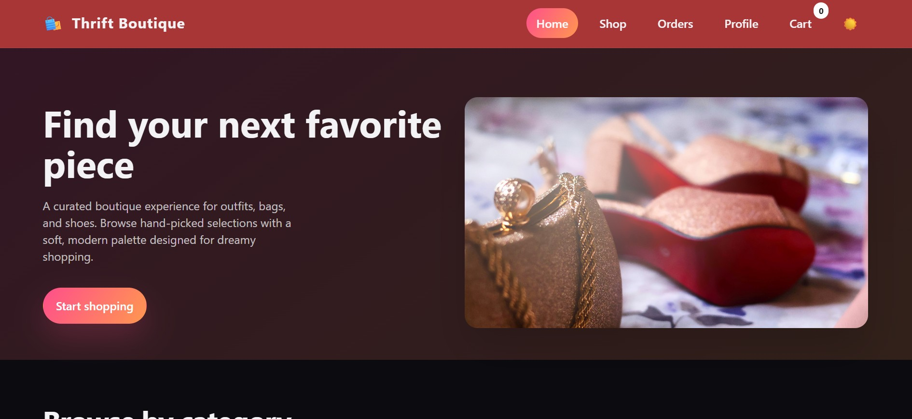

# Thrift Boutique

A lightweight thrift storefront built with HTML, CSS, and JavaScript.

## Overview

This project is a frontend-only boutique shopping demo with:

- a home page with featured products and category browsing
- a shop page with search, category filtering, sorting, and price filters
- a product detail page
- a cart with persistent local storage
- a demo checkout flow that asks the user to sign in or create an account before placing an order

## Tech Stack

- HTML
- CSS
- JavaScript
- `localStorage` for cart and demo login session data

## Live Demo

https://johnkinyadev.github.io/thrift_website/

## Project Structure

- `index.html` - home page
- `products.html` - product listing and filters
- `product.html` - single product view
- `cart.html` - cart and checkout flow
- `products.js` - product catalog and filtering helpers
- `scripts.js` - shared UI, cart, theme, and auth helpers
- `styles.css` - site styling
- `images/` - product and category images

## How to Run

Because this is a static frontend project, you can run it by opening `index.html` in your browser.

For a smoother local development experience, use a simple static server. For example:

```powershell
python -m http.server 5500
```

Then open:

```text
http://localhost:5500
```

## Demo Checkout Notes

- checkout requires the shopper to sign in or create an account
- account and session data are stored in the browser with `localStorage`
- this is a demo flow only and is not connected to a real backend or payment gateway

## Git Workflow

Recent work in this repo has been split into smaller commits instead of one large commit:

- product catalog and shop filtering updates
- storefront image fallback improvements
- login-required checkout flow

## Overview Of The Website



## Future Improvements

- connect checkout to a real backend and payment service
- replace demo authentication with secure server-side auth
- add product management from an admin dashboard
- improve mobile navigation and accessibility
